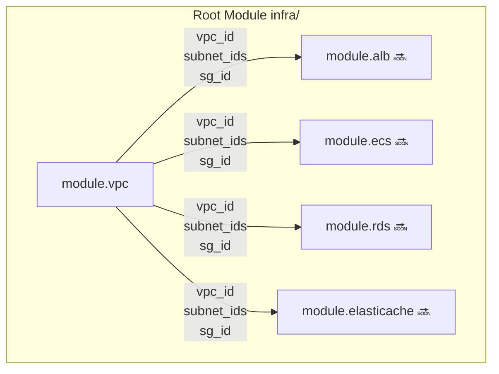
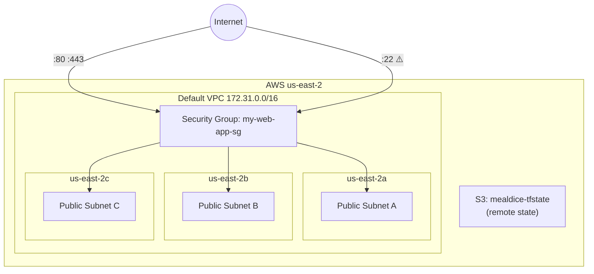

# MealDice — Infrastructure

Terraform-managed AWS infrastructure targeting region `us-east-2`.

> **Note:** Architecture diagrams are manually maintained. Update this file when adding new modules.

---

## Directory Structure

```
infra/
├── main.tf           # Root module: wires all child modules together
├── variables.tf      # Global variable definitions
├── provider.tf       # AWS Provider + default_tags
├── backend.tf        # Remote state → S3
├── envs/
│   └── prod.tfvars   # Production variable values (gitignored)
├── bootstrap/        # One-time setup: creates the S3 state bucket
└── modules/
    └── vpc/          # Network layer (imported)
```

---

## Module Architecture



Modules pass values to each other via `output → variable` references — no hardcoded AWS resource IDs.

---

## Network Architecture (Current)



**Current network characteristics:**
- Uses AWS Default VPC — `terraform destroy` will not actually delete it
- All 3 AZ subnets are public (inherent to Default VPC)
- All resources share a single Security Group (legacy)

---

## Security Group Rules

| Direction | Port | Source | Purpose |
|-----------|------|--------|---------|
| Ingress | 80 | `0.0.0.0/0` | Public HTTP access |
| Ingress | 443 | `0.0.0.0/0` | Public HTTPS access |
| Ingress | 22 | `0.0.0.0/0` | SSH ⚠️ needs to be restricted |
| Ingress | 3001 | self | ALB → ECS backend |
| Ingress | 6379 | self | ECS → ElastiCache Redis |
| Egress | ALL | `0.0.0.0/0` | Unrestricted outbound |

---

## Global Variables

| Variable | Default | Description |
|----------|---------|-------------|
| `aws_region` | `us-east-2` | Primary region |
| `app_name` | `mealdice` | Prefix for all resource names |
| `environment` | — | `prod` or `dev` |
| `db_password` | — | RDS master password (sensitive) |
| `db_username` | `admin` | RDS master username |
| `db_name` | `mealdice` | Application database schema name |
| `domain_name` | — | Primary domain, e.g. `mealdice.com` |
| `github_repo` | `986913/WHATTOEAT` | OIDC trust policy scope |

---

## Remote State

| Config | Value |
|--------|-------|
| S3 Bucket | `mealdice-tfstate` |
| Key | `prod/terraform.tfstate` |
| Encryption | ✓ |
| Locking | S3 native lock (`.tflock`, requires Terraform ≥ 1.10) |

---

## Common Commands

```bash
# Initialize (required after first clone or adding a new module)
terraform init

# Preview changes without applying
terraform plan -var-file=envs/prod.tfvars

# Apply changes
terraform apply -var-file=envs/prod.tfvars

# Import an existing AWS resource into state
terraform import -var-file=envs/prod.tfvars <resource_address> <aws_id>

# Inspect current state
terraform state list
terraform state show <resource_address>
```

---

## Known Technical Debt

| Issue | Risk | Priority |
|-------|------|----------|
| Port 22 open to the world | SSH brute-force exposure | High |
| All subnets are public | Database directly reachable from internet | Medium |
| Single shared Security Group | Cannot enforce least-privilege between layers | Medium |
| Using Default VPC | Does not meet production security baseline | Low (high migration cost) |
