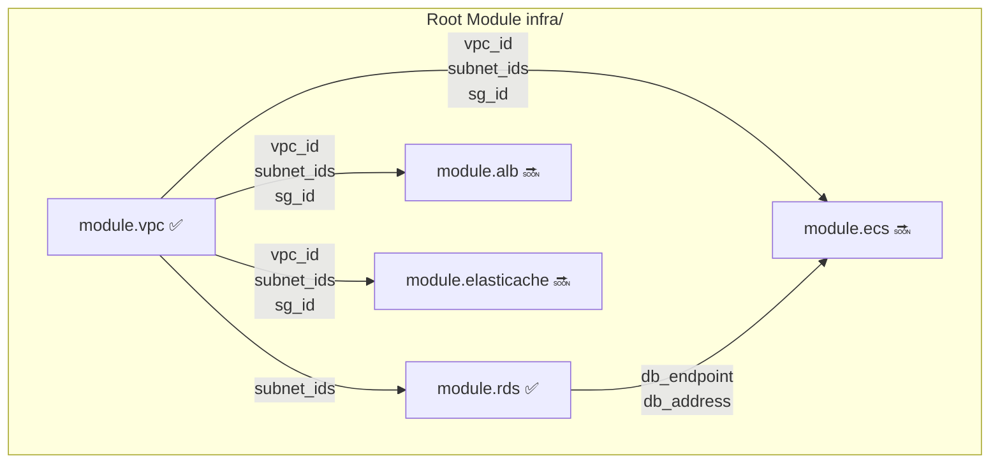
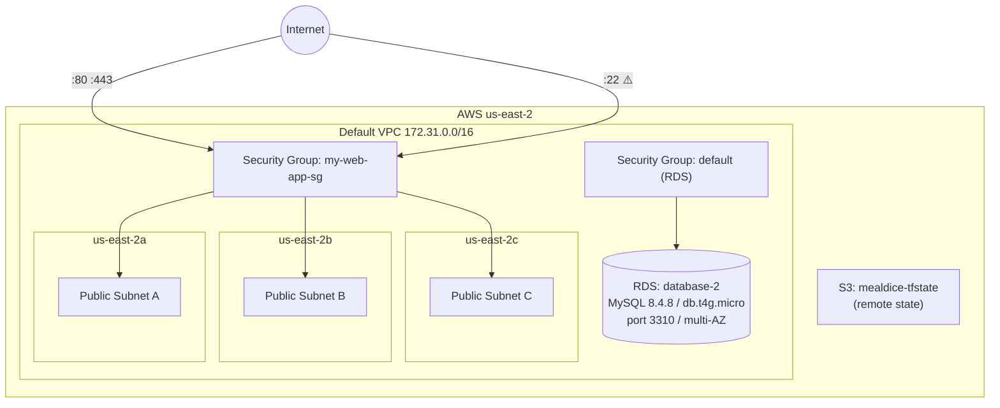

# MealDice — Infrastructure

Terraform-managed AWS infrastructure targeting region `us-east-2`.

> **Note:** Architecture diagrams are manually maintained. Update this file when adding new modules.

---

## Directory Structure

```
infra/
├── main.tf           # Root module: wires all child modules together
├── variables.tf      # Global variable definitions
├── provider.tf       # AWS Provider + default_tags
├── backend.tf        # Remote state → S3
├── envs/
│   └── prod.tfvars   # Production variable values (gitignored)
├── bootstrap/        # One-time setup: creates the S3 state bucket
└── modules/
    ├── vpc/          # Network layer (imported)
    └── rds/          # RDS MySQL 8.4.8 instance + DB subnet group (imported)
```

---

## Module Architecture



Modules pass values to each other via `output → variable` references — no hardcoded AWS resource IDs.

---

## Network Architecture (Current)



**Current network characteristics:**
- Uses AWS Default VPC — `terraform destroy` will not actually delete it
- All 3 AZ subnets are public (inherent to Default VPC)
- All resources share a single Security Group (legacy)

---

## Security Group Rules

| Direction | Port | Source | Purpose |
|-----------|------|--------|---------|
| Ingress | 80 | `0.0.0.0/0` | Public HTTP access |
| Ingress | 443 | `0.0.0.0/0` | Public HTTPS access |
| Ingress | 22 | `0.0.0.0/0` | SSH ⚠️ needs to be restricted |
| Ingress | 3001 | self | ALB → ECS backend |
| Ingress | 6379 | self | ECS → ElastiCache Redis |
| Egress | ALL | `0.0.0.0/0` | Unrestricted outbound |

---

## Global Variables

| Variable | Default | Description |
|----------|---------|-------------|
| `aws_region` | `us-east-2` | Primary region |
| `app_name` | `mealdice` | Prefix for all resource names |
| `environment` | — | `prod` or `dev` |
| `db_password` | — | RDS master password (sensitive) |
| `db_username` | `admin` | RDS master username |
| `db_name` | `mealdice` | App env var — schema name (`eatdbprod` in prod, created manually via CLI) |
| `domain_name` | — | Primary domain, e.g. `mealdice.com` |
| `github_repo` | `986913/WHATTOEAT` | OIDC trust policy scope |
| `rds_sg_id` | `sg-09ffc1c2310dbf1d8` | SG attached to RDS — VPC default SG (legacy, not app SG) |

---

## RDS Module

| Field | Value |
|-------|-------|
| Identifier | `database-2` |
| Engine | MySQL `8.4.8` |
| Instance class | `db.t4g.micro` |
| Port | `3310` |
| Multi-AZ | `true` |
| Storage | 20 GB gp2, autoscale up to 1000 GB |
| Encryption | ✓ at-rest |
| Backup retention | 1 day |
| Monitoring interval | 60s (Enhanced Monitoring) |
| Subnet group | `default-vpc-0de0822aefb86efbd` |
| Security group | `sg-09ffc1c2310dbf1d8` (VPC default SG, **not** the app SG) |
| `db_name` | Not set — `eatdbprod` schema was created manually via CLI after instance creation |
| `deletion_protection` | `false` (legacy — should be enabled) |
| `publicly_accessible` | `true` (legacy — should be disabled) |

**Import commands used:**
```bash
terraform import -var-file=envs/prod.tfvars \
  module.rds.aws_db_subnet_group.main default-vpc-0de0822aefb86efbd

terraform import -var-file=envs/prod.tfvars \
  module.rds.aws_db_instance.main database-2
```

---

## Remote State

| Config | Value |
|--------|-------|
| S3 Bucket | `mealdice-tfstate` |
| Key | `prod/terraform.tfstate` |
| Encryption | ✓ |
| Locking | S3 native lock (`.tflock`, requires Terraform ≥ 1.10) |

---

## Common Commands

```bash
# Initialize (required after first clone or adding a new module)
terraform init

# Preview changes without applying
terraform plan -var-file=envs/prod.tfvars

# Apply changes
terraform apply -var-file=envs/prod.tfvars

# Import an existing AWS resource into state
terraform import -var-file=envs/prod.tfvars <resource_address> <aws_id>

# Inspect current state
terraform state list
terraform state show <resource_address>
```

---

## Known Technical Debt

| Issue | Risk | Priority |
|-------|------|----------|
| Port 22 open to the world | SSH brute-force exposure | High |
| `deletion_protection = false` on RDS | Accidental `terraform destroy` would delete prod database | High |
| `publicly_accessible = true` on RDS | Database port 3310 reachable from public internet | High |
| RDS uses VPC default SG instead of dedicated SG | No layer isolation; default SG rules are shared across all resources | Medium |
| All subnets are public | Database directly reachable from internet | Medium |
| Single shared Security Group (`my-web-app-sg`) | Cannot enforce least-privilege between layers | Medium |
| `backup_retention_period = 1` on RDS | Only 1 day of automated backups — data loss window is large | Medium |
| Using Default VPC | Does not meet production security baseline | Low (high migration cost) |
