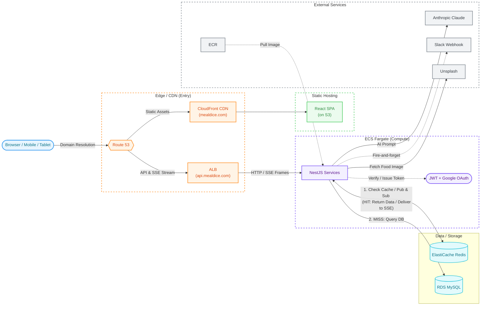
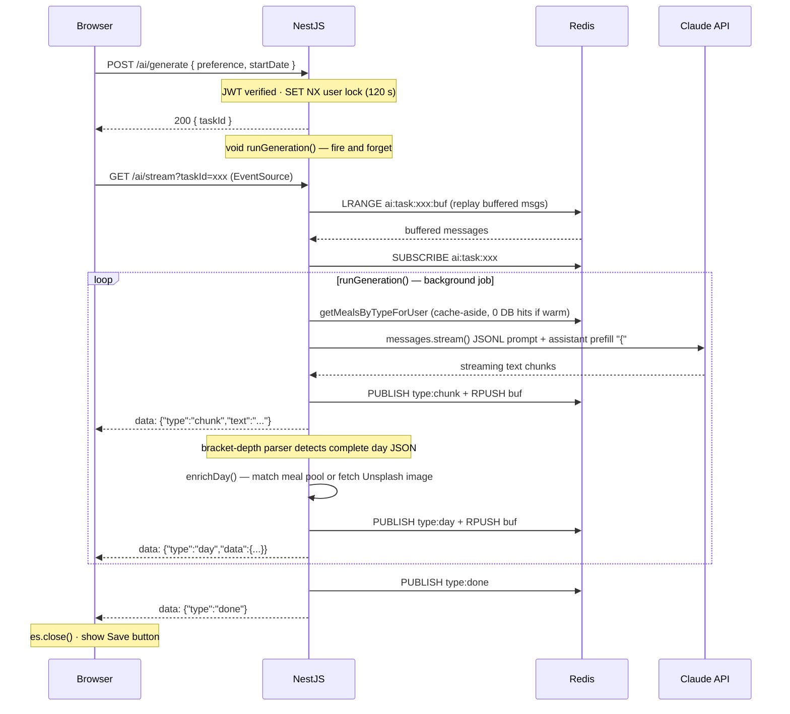
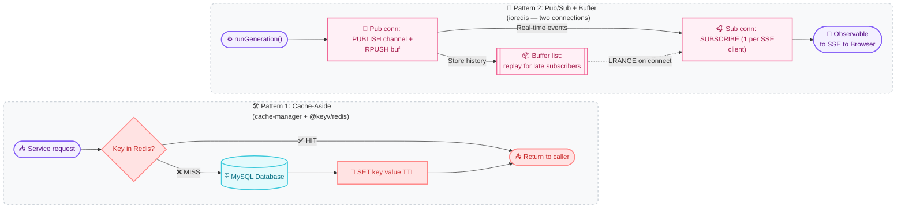
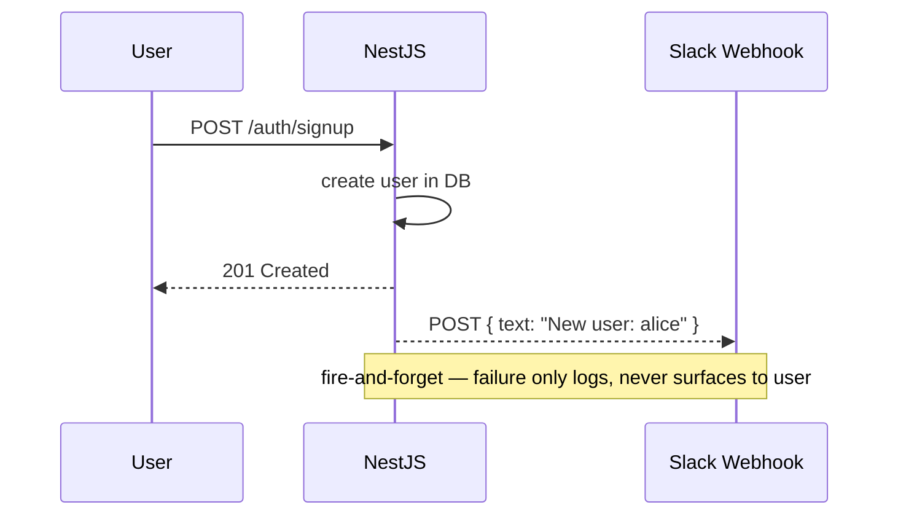
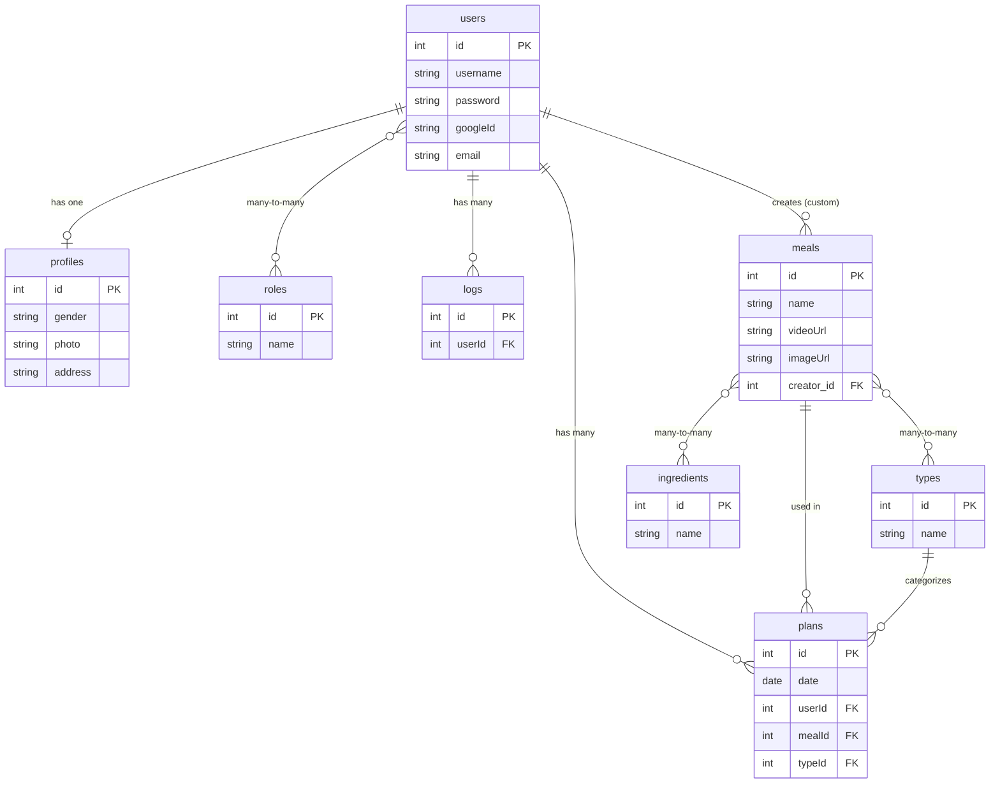
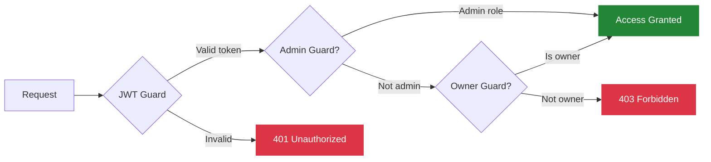

# MealDice — What Should We Cook Today?

**Live:** [mealdice.com](https://mealdice.com)

A full-stack meal planning app that eliminates the daily "what should I eat?" dilemma. Roll the dice, get personalized meals, and plan your week with AI — all in one place.

| Phase                          | Focus                                                                   | Status  |
| ------------------------------ | ----------------------------------------------------------------------- | ------- |
| **1 — High Availability**      | ALB · ECS Fargate · ElastiCache · S3 + CloudFront                       | ✅ Done |
| **2 — AI Meal Planning**       | Claude streaming via SSE · Redis Pub/Sub bridge · cache-aside meal pool | ✅ Done |
| **3 — Infrastructure as Code** | Terraform / CDK                                                         | Planned |

---

## Features

- **Today View** — breakfast, lunch, and dinner at a glance with food imagery
- **Meal Dice** — randomize individual meals or an entire day in one tap
- **Weekly Planner** — auto-generate a 7-day plan, adjust any meal, save
- **AI Meal Planning** — describe your preference in any language; Claude generates a personalized week streamed live with progressive card rendering
- **Custom Meals** — create private meals that appear alongside public ones
- **Plan History** — paginated history with date range and meal name filters
- **Google OAuth + Email Auth** — sign in with Google or email; password reset supported
- **Role-Based Access** — admin panel for meals, ingredients, users, roles
- **Cooking Videos** — tap any meal to watch its tutorial

---

## Architecture

### System Overview



> **Cache-aside:** NestJS always checks Redis first. On a HIT the response is returned immediately. On a MISS, NestJS queries MySQL directly, writes the result back to Redis, then returns. **Redis never connects to MySQL.**
>
> **Pub/Sub:** The AI background job PUBLISHes to a Redis channel. The SSE handler SUBSCRIBEs on the same channel and forwards events to the browser over the existing `EventSource` connection. See zoom-ins below for detail.

---

<details>
<summary><strong>🔍 Zoom — AI as a Feature</strong></summary>

Claude is **not** a separate microservice. `AiModule` lives inside the same Fargate container. It reads the user's meal library from the **shared Redis cache**, builds a prompt, streams the LLM response, and bridges the output to the browser through Redis Pub/Sub → SSE — all without blocking the HTTP response.



**Why two separate endpoints?**

|           | `POST /ai/generate`                                  | `GET /ai/stream`                                                                  |
| --------- | ---------------------------------------------------- | --------------------------------------------------------------------------------- |
| Transport | axios — can set`Authorization` header + request body | `EventSource` — GET only, no custom headers                                       |
| Auth      | JWT Guard                                            | None —`taskId` UUID is the unguessable scope token                                |
| Response  | `{ taskId }` in < 200 ms                             | Persistent SSE connection until`done` or `error`                                  |
| Why split | `EventSource` cannot POST or send JWT                | Decouples trigger from delivery; supports reconnect without restarting generation |

</details>

---

<details>
<summary><strong>🔍 Zoom — Redis Patterns</strong></summary>

Redis serves two completely independent roles with separate connection strategies.



| Pattern              | Keys                                  | TTL                | Purpose                                                                                                 |
| -------------------- | ------------------------------------- | ------------------ | ------------------------------------------------------------------------------------------------------- |
| **Cache-Aside**      | `meals:byType:{typeId}:user:{userId}` | 2 min ± 20% jitter | Skip MySQL joins for the meal pool; AI generation calls this 3× per run — warm cache means 0 DB queries |
| **Pub/Sub**          | `ai:task:{taskId}` channel            | —                  | Bridge the background AI job (outlives the HTTP request) to the SSE subscriber on a separate connection |
| **Buffer List**      | `ai:task:{taskId}:buf`                | 10 min             | Replay missed events when`EventSource` connects after generation starts                                 |
| **Distributed Lock** | `ai:user:{userId}:generating`         | 120 s              | `SET key value EX 120 NX` — prevent the same user from triggering two parallel AI jobs                  |

> **Why two ioredis instances?** A Redis connection that has executed `SUBSCRIBE` enters subscriber-only mode and can no longer issue any other command (`PUBLISH`, `GET`, `SET`, etc.). So `pub` is a single shared connection for all normal commands; each SSE client gets its own `sub` instance, disconnected when the browser drops the connection.

> **Why jitter on TTL?** Without it, entries set at the same time all expire together — causing a thundering herd of simultaneous DB queries (cache stampede). A ±20% random offset spreads the expiry window.

</details>

---

<details>
<summary><strong>🔍 Zoom — Slack Webhook Notifications</strong></summary>

Server events are pushed to a Slack channel via [Slack Incoming Webhooks](https://api.slack.com/messaging/webhooks) — fire-and-forget, never blocking the API response.



| Event               | Trigger                            | Example message                           |
| ------------------- | ---------------------------------- | ----------------------------------------- |
| New user signup     | `POST /auth/signup`                | `New user signed up: alice`               |
| Google OAuth signup | `/auth/google/callback` (new user) | `New Google user signed up: alice`        |
| Custom meal created | `POST /meals/my`                   | `Custom meal created: "Pasta" by user #5` |
| User feedback       | `POST /feedback`                   | `[FEEDBACK] from alice: "Love the app!"`  |
| Server error (5xx)  | Any unhandled exception            | `[SERVER ERROR] GET /api/v1/plans — 500`  |

- **5xx only** — 4xx client errors are intentionally excluded to avoid noise
- **Graceful degradation** — if `SLACK_WEBHOOK_URL` is unset, the service logs a warning at startup and skips all notifications silently

</details>

---

## Data Model



> Constraint: `UNIQUE(user_id, date, type_id)` — one meal per user per slot per day.

---

## Tech Stack

### Frontend

| Technology                        | Purpose                      |
| --------------------------------- | ---------------------------- |
| **React 19**                      | UI framework                 |
| **TypeScript**                    | Type safety                  |
| **React Router 7**                | Client-side routing          |
| **Zustand**                       | Lightweight state management |
| **Bootstrap 5 + React-Bootstrap** | UI components                |
| **Axios**                         | HTTP client                  |
| **S3 + CloudFront**               | Static hosting & global CDN  |

### Backend

| Technology            | Purpose                                                                                |
| --------------------- | -------------------------------------------------------------------------------------- |
| **NestJS 11**         | Server framework (Node.js)                                                             |
| **TypeScript 5**      | Type safety                                                                            |
| **TypeORM**           | Database ORM                                                                           |
| **MySQL 8.0**         | Relational database                                                                    |
| **ElastiCache Redis** | Cache-Aside (meal pool, TTL jitter) + Pub/Sub (AI streaming bridge) + distributed lock |
| **Anthropic Claude**  | LLM meal plan generation —`claude-haiku-4-5`, streaming JSONL via `messages.stream()`  |
| **ioredis**           | Low-level Redis client for Pub/Sub + buffer list (separate from cache-manager)         |
| **Unsplash API**      | Food image lookup for AI-suggested meals not in the library                            |
| **Passport.js**       | Authentication (JWT + Google OAuth)                                                    |
| **Argon2**            | Password hashing                                                                       |
| **Nodemailer**        | Email service (password reset)                                                         |
| **Winston**           | Structured logging                                                                     |
| **Slack Webhook**     | Real-time notifications (Incoming Webhook, fire-and-forget)                            |
| **class-validator**   | DTO validation                                                                         |
| **Jest + Supertest**  | Unit & integration testing                                                             |

### DevOps & Infrastructure

| Technology              | Purpose                              |
| ----------------------- | ------------------------------------ |
| **AWS ECS Fargate**     | Serverless container hosting         |
| **AWS ECR**             | Docker image registry                |
| **AWS ALB**             | Load balancing + HTTPS termination   |
| **AWS S3 + CloudFront** | Frontend static hosting + global CDN |
| **AWS ElastiCache**     | Managed Redis with TLS               |
| **AWS RDS**             | Managed MySQL                        |
| **AWS ACM**             | SSL/TLS certificates                 |
| **AWS Route 53**        | DNS management                       |
| **Docker**              | Container build                      |
| **GitHub Actions**      | CI/CD pipeline                       |
| **Semantic Release**    | Automated versioning & releases      |
| **Commitlint + Husky**  | Conventional commit enforcement      |

---

## CI/CD Pipeline

```mermaid
flowchart LR
    classDef trigger fill:#FF6B35,stroke:#c4491a,stroke-width:2px,color:#fff,rx:20px,ry:20px;
    classDef test fill:#6f42c1,stroke:#4c2889,stroke-width:2px,color:#fff,rx:8px,ry:8px;
    classDef release fill:#238636,stroke:#175c22,stroke-width:2px,color:#fff,rx:8px,ry:8px;
    classDef decision fill:#fff3cd,stroke:#ffe69c,stroke-width:2px,color:#664d03;
    classDef docker fill:#2496ED,stroke:#1668a8,stroke-width:2px,color:#fff,rx:6px,ry:6px;
    classDef s3 fill:#51cf66,stroke:#2b8a3e,stroke-width:2px,color:#fff,rx:6px,ry:6px;
    classDef skip fill:#f8f9fa,stroke:#ced4da,stroke-width:2px,color:#adb5bd,stroke-dasharray: 5 5,rx:20px,ry:20px;

    style CIPhase      fill:none,stroke:#6f42c1,stroke-width:2px,stroke-dasharray:5 5
    style ReleasePhase fill:none,stroke:#238636,stroke-width:2px,stroke-dasharray:5 5
    style FEDeploy     fill:none,stroke:#51cf66,stroke-width:2px,stroke-dasharray:5 5
    style BEDeploy     fill:none,stroke:#2496ED,stroke-width:2px,stroke-dasharray:5 5

    A(["Push to main"]):::trigger

    subgraph CIPhase ["CI"]
        direction LR
        T["Test Job"]:::test
        T1["Unit Tests 78"]:::test
        T2["Integration Tests 22"]:::test
    end

    subgraph ReleasePhase ["Release"]
        direction LR
        B["Semantic Release"]:::release
        C{"New release?"}:::decision
        D["GitHub Release"]:::release
        F(["Skip"]):::skip
    end

    subgraph FEDeploy ["Frontend Deploy"]
        direction LR
        FE1["npm run build"]:::s3
        FE2["S3 sync"]:::s3
        FE3["CloudFront invalidate"]:::s3
    end

    subgraph BEDeploy ["Backend Deploy"]
        direction LR
        BE1["Docker build"]:::docker
        BE2["Push to ECR"]:::docker
        BE3["ECS rolling update"]:::docker
    end

    A ==> T
    T --> T1
    T --> T2
    T1 & T2 ==> B
    B -- "Analyze commits" --> C
    C == "Yes" ==> D
    C -. "No" .-> F
    D ==> FE1
    FE1 --> FE2 --> FE3
    D ==> BE1
    BE1 --> BE2 --> BE3
```



Versioning follows [Conventional Commits](https://www.conventionalcommits.org/): `feat:` → minor · `fix:` → patch · `feat!:` → major

---

## API Reference

All endpoints are prefixed with `/api/v1`.

<details>
<summary><strong>Auth</strong> — <code>/auth</code></summary>

| Method | Endpoint                | Auth   | Description                  |
| ------ | ----------------------- | ------ | ---------------------------- |
| `POST` | `/auth/signup`          | Public | Register with email          |
| `POST` | `/auth/signin`          | Public | Login — returns JWT          |
| `GET`  | `/auth/me`              | JWT    | Get current user             |
| `POST` | `/auth/forgot-password` | Public | Request password reset email |
| `POST` | `/auth/reset-password`  | Public | Reset password with token    |
| `GET`  | `/auth/google`          | Public | Initiate Google OAuth        |
| `GET`  | `/auth/google/callback` | Public | Google OAuth callback        |

</details>

<details>
<summary><strong>Users</strong> — <code>/users</code></summary>

| Method   | Endpoint             | Auth              | Description                                           |
| -------- | -------------------- | ----------------- | ----------------------------------------------------- |
| `GET`    | `/users`             | JWT               | List all users (filterable by username, role, gender) |
| `POST`   | `/users`             | JWT               | Create a new user                                     |
| `GET`    | `/users/:id`         | JWT               | Get user by ID                                        |
| `PUT`    | `/users/:id`         | JWT + Owner/Admin | Update user                                           |
| `DELETE` | `/users/:id`         | JWT + Admin       | Delete user                                           |
| `GET`    | `/users/profile`     | JWT               | Get profile`?id=`                                     |
| `GET`    | `/users/logs`        | JWT               | Activity logs`?id=`                                   |
| `GET`    | `/users/logsByGroup` | JWT               | Logs grouped by result`?id=`                          |

</details>

<details>
<summary><strong>Meals</strong> — <code>/meals</code></summary>

| Method   | Endpoint         | Auth  | Description                                 |
| -------- | ---------------- | ----- | ------------------------------------------- |
| `GET`    | `/meals`         | Admin | List meals (paginated`?page=&limit=&type=`) |
| `GET`    | `/meals/options` | Admin | Meal options by type`?typeId=`              |
| `POST`   | `/meals`         | Admin | Create meal                                 |
| `GET`    | `/meals/:id`     | Admin | Get meal by ID                              |
| `PUT`    | `/meals/:id`     | Admin | Update meal                                 |
| `DELETE` | `/meals/:id`     | Admin | Delete meal                                 |
| `GET`    | `/meals/my`      | JWT   | Current user's custom meals (paginated)     |
| `POST`   | `/meals/my`      | JWT   | Create custom meal                          |
| `PUT`    | `/meals/my/:id`  | JWT   | Update own custom meal                      |
| `DELETE` | `/meals/my/:id`  | JWT   | Delete own custom meal                      |

</details>

<details>
<summary><strong>Plans</strong> — <code>/plans</code></summary>

| Method   | Endpoint                | Auth  | Description                                                            |
| -------- | ----------------------- | ----- | ---------------------------------------------------------------------- |
| `GET`    | `/plans`                | Admin | List all plans                                                         |
| `GET`    | `/plans/byUser`         | Admin | Plans grouped by user                                                  |
| `GET`    | `/plans/me`             | JWT   | Current user's saved plans (`?from=&to=&sort=&page=&limit=&mealName=`) |
| `POST`   | `/plans`                | JWT   | Create single plan                                                     |
| `POST`   | `/plans/weekly-preview` | JWT   | Generate 7-day draft (not persisted)                                   |
| `POST`   | `/plans/replace-meal`   | JWT   | Random replacement for a meal slot                                     |
| `POST`   | `/plans/weekly-commit`  | JWT   | Bulk save weekly plans                                                 |
| `DELETE` | `/plans/:id`            | JWT   | Delete a plan                                                          |

</details>

<details>
<summary><strong>AI</strong> — <code>/ai</code></summary>

| Method | Endpoint       | Auth     | Description                                                                   |
| ------ | -------------- | -------- | ----------------------------------------------------------------------------- |
| `POST` | `/ai/generate` | JWT      | Start AI generation — returns`{ taskId }` immediately; runs as background job |
| `GET`  | `/ai/stream`   | Public\* | SSE long-connection — streams`chunk` / `day` / `done` / `error` / `heartbeat` |

> \* `EventSource` cannot send `Authorization` headers. The `taskId` (UUID v4) is the unguessable scope token. See the AI zoom-in above for the full sequence.

</details>

<details>
<summary><strong>Ingredients</strong> — <code>/ingredients</code>  &  <strong>Feedback</strong> — <code>/feedback</code></summary>

**Ingredients** (Admin only)

| Method   | Endpoint           | Description |
| -------- | ------------------ | ----------- |
| `GET`    | `/ingredients`     | List all    |
| `POST`   | `/ingredients`     | Create      |
| `PUT`    | `/ingredients/:id` | Update      |
| `DELETE` | `/ingredients/:id` | Delete      |

**Feedback**

| Method | Endpoint    | Auth | Description                                       |
| ------ | ----------- | ---- | ------------------------------------------------- |
| `POST` | `/feedback` | JWT  | Submit feedback — forwarded to Slack, no DB write |

</details>

<details>
<summary><strong>Auth Guards</strong></summary>



</details>

---

## Testing

```bash
cd packages/backend

npm run test:unit          # 78 unit tests (services layer)
npm run test:integration   # 22 integration tests (HTTP layer)
npm test                   # all 100 tests
npm run test:cov           # with coverage report
```

| Layer           | Framework              | What's Tested                                                                                |
| --------------- | ---------------------- | -------------------------------------------------------------------------------------------- |
| **Unit**        | Jest + @nestjs/testing | PlanService, AuthService, MealService, UserService — business logic, validations, edge cases |
| **Integration** | Jest + Supertest       | Auth flow, Plan flow, DTO validation (400s), RBAC (403s)                                     |
| **CI Gate**     | GitHub Actions         | All tests must pass before semantic-release and deploy                                       |

---

## Getting Started

### Prerequisites

- Node.js 20+
- Docker & Docker Compose
- npm

### Local Development

```bash
# 1. Clone
git clone https://github.com/mingyueliu/whatToEat.git
cd whatToEat

# 2. Install
npm install

# 3. Start MySQL + Redis
docker compose -f docker-compose.db.yml -p whattoeat-local up -d

# 4. Seed database (first time only)
cd packages/backend && npm run seed && cd ../..

# 5. Start frontend + backend
npm run dev
```

| Service       | URL                   |
| ------------- | --------------------- |
| Frontend      | http://localhost:3000 |
| Backend       | http://localhost:3001 |
| MySQL         | localhost:3307        |
| Redis         | localhost:6379        |
| Redis Insight | http://localhost:8001 |

Production deploys automatically via GitHub Actions on push to `main` — no manual steps.

---

## Project Structure

<details>
<summary>Expand</summary>

```
whatToEat/
├── .github/workflows/
│   └── deploy.yml
├── packages/
│   ├── backend/
│   │   ├── config/             # Environment YAML configs (dev / prod)
│   │   ├── src/
│   │   │   ├── ai/             # AiModule — AiController (@Sse), AiService, RedisPubSubService
│   │   │   ├── auth/           # JWT + Google OAuth + password reset
│   │   │   ├── cache/          # Global Redis cache module (cache-aside via cache-manager)
│   │   │   ├── feedback/       # User feedback (Slack webhook only, no DB)
│   │   │   ├── filters/        # Global exception handlers
│   │   │   ├── guards/         # JWT · Admin · OwnerOrAdmin guards
│   │   │   ├── ingredient/     # Ingredient management
│   │   │   ├── mail/           # Nodemailer email service
│   │   │   ├── meal/           # Meal CRUD + user custom meals (cache-aside)
│   │   │   ├── plan/           # Weekly planner (cache-aside for meal pool)
│   │   │   ├── role/           # RBAC roles
│   │   │   ├── seeds/          # DB seed script
│   │   │   ├── slack/          # Slack webhook (fire-and-forget)
│   │   │   ├── type/           # Meal types (breakfast / lunch / dinner)
│   │   │   ├── user/           # User management + profiles
│   │   │   └── app.module.ts
│   │   ├── test/               # Integration tests (Supertest)
│   │   └── Dockerfile
│   └── frontend/
│       ├── src/
│       │   ├── components/     # Shared UI (AiGenerateModal, MealCard, ...)
│       │   ├── hooks/          # useAiMealPlan — EventSource + SSE 4-state machine
│       │   ├── pages/
│       │   │   ├── today/      # Today's meals view
│       │   │   ├── weekplans/  # Weekly planner + AI streaming UI
│       │   │   ├── userplans/  # Saved plan history
│       │   │   ├── meals/      # Admin meal management
│       │   │   └── profile/    # User profile
│       │   ├── store/          # Zustand stores
│       │   └── styles/
│       └── Dockerfile
├── docker-compose.db.yml       # Local MySQL + Redis + Redis Insight
└── package.json                # Monorepo root
```

</details>

---

## License

MIT · Built by **Mingyue Liu** | [mealdice.com](https://mealdice.com)
