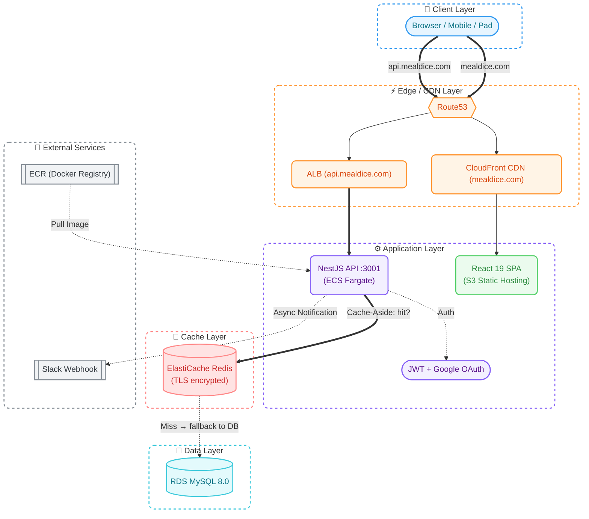
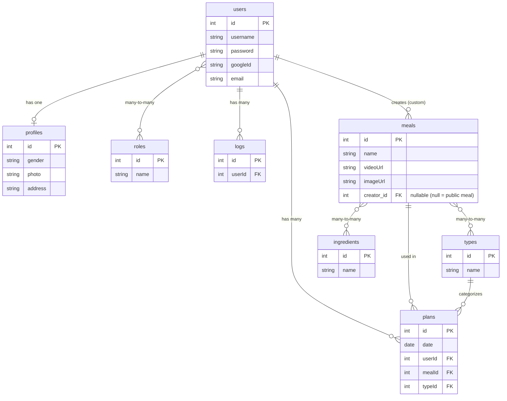
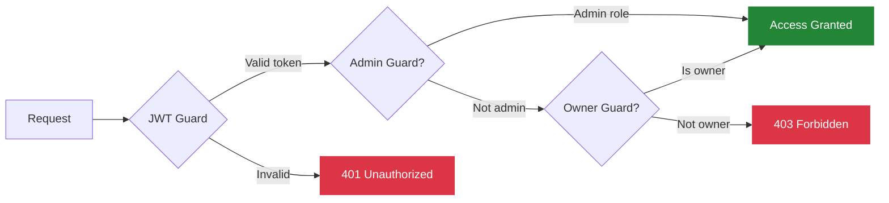
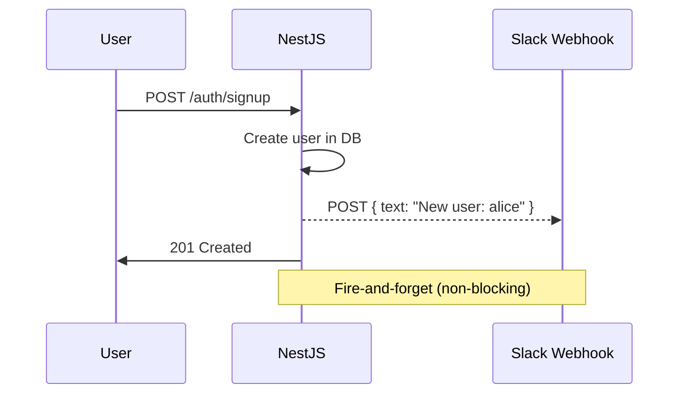

# MealDice — What Should We Cook Today?

> **Roadmap:**
>
> | Phase | Focus | Status |
> |-------|-------|--------|
> | **1 — High Availability** | Eliminate single points of failure — ALB, ECS Fargate, ElastiCache, S3 + CloudFront | **Done** |
> | **2 — AI-Powered Meal Planning** | LLM-driven weekly plan generation with streaming UI (SSE), smart caching to reduce token cost, and async task queue | Up Next |
> | **3 — Infrastructure as Code** | Codify the entire architecture with Terraform / CDK | Planned |

**Live:** [https://mealdice.com](https://mealdice.com)

### Description

A full-stack meal planning application that eliminates the daily "what should I eat?" dilemma. Roll the dice, get personalized meals, and plan your week — all in one tap.

---

## Features

- **Today View** — See today's breakfast, lunch, and dinner at a glance with large food imagery
- **Meal Dice (Shuffle)** — Randomize individual meals or your entire day with a single tap
- **Weekly Meal Plans** — Auto-generate a full 7-day meal plan, adjust any meal, and save
- **Smart Meal Replacement** — Swap out any meal while respecting your type preferences (breakfast/lunch/dinner)
- **Custom Meals** — Create and manage your own private meals that appear alongside public ones
- **Saved Plans History** — Browse your saved meal history with pagination, date range filters, and meal name search
- **Google OAuth + Email Auth** — Sign in with Google or create an account with email; supports password reset via email
- **Role-Based Access** — Admin panel for managing meals, ingredients, users, and roles
- **Feedback** — In-app feedback section for users to share suggestions
- **Cooking Videos** — Click any meal to watch its cooking tutorial
- **Responsive Design** — Works on desktop and mobile

---

#### Architecture



---

## Data Model



> Constraint: `UNIQUE(user_id, date, type_id)` — one meal per user per slot per day.

---

## Tech Stack

### Frontend

| Technology                        | Purpose                             |
| --------------------------------- | ----------------------------------- |
| **React 19**                      | UI framework                        |
| **TypeScript**                    | Type safety                         |
| **React Router 7**                | Client-side routing                 |
| **Zustand**                       | Lightweight state management        |
| **Bootstrap 5 + React-Bootstrap** | UI components                       |
| **Axios**                         | HTTP client                         |
| **S3 + CloudFront**               | Static hosting & global CDN         |

### Backend

| Technology           | Purpose                                           |
| -------------------- | ------------------------------------------------- |
| **NestJS 11**        | Server framework (Node.js)                        |
| **TypeScript 5**     | Type safety                                       |
| **TypeORM**          | Database ORM                                      |
| **MySQL 8.0**        | Relational database                               |
| **ElastiCache Redis** | Query cache (cache-aside pattern with TTL jitter, TLS encrypted) |
| **Passport.js**      | Authentication (JWT + Google OAuth)               |
| **Argon2**           | Password hashing                                  |
| **Nodemailer**       | Email service (password reset)                    |
| **Winston**          | Structured logging                                |
| **Slack Webhook**    | Real-time notifications (Incoming Webhook)        |
| **class-validator**  | DTO validation                                    |
| **Jest + Supertest** | Unit & integration testing                        |

### DevOps & Infrastructure

| Technology                  | Purpose                                          |
| --------------------------- | ------------------------------------------------ |
| **AWS ECS Fargate**         | Serverless container hosting (no EC2 to manage)  |
| **AWS ECR**                 | Docker image registry                            |
| **AWS ALB**                 | Load balancing + HTTPS termination (api.mealdice.com) |
| **AWS S3 + CloudFront**     | Frontend static hosting + global CDN (mealdice.com)   |
| **AWS ElastiCache**         | Managed Redis with TLS                           |
| **AWS RDS**                 | Managed MySQL database                           |
| **AWS ACM**                 | SSL/TLS certificates                             |
| **AWS Route 53**            | DNS management                                   |
| **Docker**                  | Container build (local dev + CI)                 |
| **GitHub Actions**          | CI/CD pipeline                                   |
| **Semantic Release**        | Automated versioning & releases                  |
| **Commitlint + Husky**      | Conventional commit enforcement                  |

---

## CI/CD Pipeline

```mermaid
flowchart LR
    classDef trigger fill:#FF6B35,stroke:#c4491a,stroke-width:2px,color:#fff,rx:20px,ry:20px;
    classDef test fill:#6f42c1,stroke:#4c2889,stroke-width:2px,color:#fff,rx:8px,ry:8px;
    classDef release fill:#238636,stroke:#175c22,stroke-width:2px,color:#fff,rx:8px,ry:8px;
    classDef decision fill:#fff3cd,stroke:#ffe69c,stroke-width:2px,color:#664d03;
    classDef deploy fill:#f8f9fa,stroke:#adb5bd,stroke-width:2px,color:#343a40,rx:8px,ry:8px;
    classDef docker fill:#2496ED,stroke:#1668a8,stroke-width:2px,color:#fff,rx:6px,ry:6px;
    classDef s3 fill:#51cf66,stroke:#2b8a3e,stroke-width:2px,color:#fff,rx:6px,ry:6px;
    classDef skip fill:#f8f9fa,stroke:#ced4da,stroke-width:2px,color:#adb5bd,stroke-dasharray: 5 5,rx:20px,ry:20px;

    style CIPhase fill:none,stroke:#6f42c1,stroke-width:2px,stroke-dasharray: 5 5,rx:10
    style ReleasePhase fill:none,stroke:#238636,stroke-width:2px,stroke-dasharray: 5 5,rx:10
    style FEDeploy fill:none,stroke:#51cf66,stroke-width:2px,stroke-dasharray: 5 5,rx:10
    style BEDeploy fill:none,stroke:#2496ED,stroke-width:2px,stroke-dasharray: 5 5,rx:10

    A(["🚀 Push to main"]):::trigger

    subgraph CIPhase ["🧪 CI"]
        direction LR
        T["Test Job"]:::test
        T1["Unit Tests (78)"]:::test
        T2["Integration Tests (22)"]:::test
    end

    subgraph ReleasePhase ["📦 Release"]
        direction LR
        B["Semantic Release"]:::release
        C{"New release?"}:::decision
        D["Create GitHub Release"]:::release
        F(["Skip"]):::skip
    end

    subgraph FEDeploy ["🌐 Frontend Deploy"]
        direction LR
        FE1["npm run build"]:::s3
        FE2["S3 sync"]:::s3
        FE3["CloudFront invalidate"]:::s3
    end

    subgraph BEDeploy ["🐳 Backend Deploy"]
        direction LR
        BE1["Docker build"]:::docker
        BE2["Push to ECR"]:::docker
        BE3["ECS rolling update"]:::docker
    end

    A ==> T
    T --> T1
    T --> T2
    T1 & T2 ==> B
    B -- "Analyze commits" --> C
    C == "Yes" ==> D
    C -. "No" .-> F

    D ==> FE1
    FE1 --> FE2 --> FE3

    D ==> BE1
    BE1 --> BE2 --> BE3
```



Versioning follows [Conventional Commits](https://www.conventionalcommits.org/):

- `feat:` → minor version bump
- `fix:` → patch version bump
- `feat!:` / `BREAKING CHANGE` → major version bump

---

## API Reference

All endpoints are prefixed with `/api/v1`.

### Auth (`/auth`)

| Method | Endpoint                | Auth   | Description                                  |
| ------ | ----------------------- | ------ | -------------------------------------------- |
| `POST` | `/auth/signup`          | Public | Register new user (with email)               |
| `POST` | `/auth/signin`          | Public | Login (returns JWT token)                    |
| `GET`  | `/auth/me`              | JWT    | Get current authenticated user               |
| `POST` | `/auth/forgot-password` | Public | Request password reset email                 |
| `POST` | `/auth/reset-password`  | Public | Reset password with token                    |
| `GET`  | `/auth/google`          | Public | Initiate Google OAuth flow                   |
| `GET`  | `/auth/google/callback` | Public | Google OAuth callback (redirects with token) |

### Users (`/users`)

| Method   | Endpoint             | Auth              | Description                                           |
| -------- | -------------------- | ----------------- | ----------------------------------------------------- |
| `GET`    | `/users`             | JWT               | List all users (filterable by username, role, gender) |
| `POST`   | `/users`             | JWT               | Create a new user                                     |
| `GET`    | `/users/:id`         | JWT               | Get user by ID                                        |
| `PUT`    | `/users/:id`         | JWT + Owner/Admin | Update user (non-admins cannot modify roles)          |
| `DELETE` | `/users/:id`         | JWT + Admin       | Delete user                                           |
| `GET`    | `/users/profile`     | JWT               | Get user profile by query`?id=`                       |
| `GET`    | `/users/logs`        | JWT               | Get user activity logs by query`?id=`                 |
| `GET`    | `/users/logsByGroup` | JWT               | Get user logs grouped by result`?id=`                 |

### Meals (`/meals`)

| Method   | Endpoint         | Auth  | Description                                                |
| -------- | ---------------- | ----- | ---------------------------------------------------------- |
| `GET`    | `/meals`         | Admin | List meals (paginated, filterable by`?page=&limit=&type=`) |
| `GET`    | `/meals/options` | Admin | Get meals by type`?typeId=`                                |
| `POST`   | `/meals`         | Admin | Create a new meal                                          |
| `GET`    | `/meals/:id`     | Admin | Get meal by ID                                             |
| `PUT`    | `/meals/:id`     | Admin | Update meal                                                |
| `DELETE` | `/meals/:id`     | Admin | Delete meal                                                |
| `GET`    | `/meals/my`      | JWT   | List current user's custom meals (paginated)               |
| `POST`   | `/meals/my`      | JWT   | Create a custom meal                                       |
| `PUT`    | `/meals/my/:id`  | JWT   | Update own custom meal                                     |
| `DELETE` | `/meals/my/:id`  | JWT   | Delete own custom meal                                     |

### Plans (`/plans`)

| Method   | Endpoint                | Auth  | Description                                                                |
| -------- | ----------------------- | ----- | -------------------------------------------------------------------------- |
| `GET`    | `/plans`                | Admin | List all plans                                                             |
| `GET`    | `/plans/byUser`         | Admin | Get all plans grouped by user                                              |
| `GET`    | `/plans/me`             | JWT   | Get current user's saved plans (`?from=&to=&sort=&page=&limit=&mealName=`) |
| `POST`   | `/plans`                | JWT   | Create a single plan                                                       |
| `POST`   | `/plans/weekly-preview` | JWT   | Generate 7-day draft plan (not persisted)                                  |
| `POST`   | `/plans/replace-meal`   | JWT   | Get random replacement meal of same type                                   |
| `POST`   | `/plans/weekly-commit`  | JWT   | Bulk save weekly plans to database                                         |
| `DELETE` | `/plans/:id`            | JWT   | Delete a plan                                                              |

### Feedback (`/feedback`)

| Method | Endpoint    | Auth | Description                                     |
| ------ | ----------- | ---- | ----------------------------------------------- |
| `POST` | `/feedback` | JWT  | Submit feedback (sent to Slack via webhook, no DB) |

### Ingredients (`/ingredients`)

| Method   | Endpoint           | Auth  | Description          |
| -------- | ------------------ | ----- | -------------------- |
| `GET`    | `/ingredients`     | Admin | List all ingredients |
| `POST`   | `/ingredients`     | Admin | Create ingredient    |
| `PUT`    | `/ingredients/:id` | Admin | Update ingredient    |
| `DELETE` | `/ingredients/:id` | Admin | Delete ingredient    |

### Auth Guards



---

## Slack Webhook Notifications

Real-time event notifications via [Slack Incoming Webhooks](https://api.slack.com/messaging/webhooks) — a lightweight, fire-and-forget integration that pushes server-side events to a Slack channel without polling.

**How it works:**



**Events notified:**

| Event               | Trigger                                | Example message                                                  |
| ------------------- | -------------------------------------- | ---------------------------------------------------------------- |
| New user signup     | `POST /auth/signup`                    | `New user signed up: alice`                                      |
| Google OAuth signup | `GET /auth/google/callback` (new user) | `New Google user signed up: alice`                               |
| Custom meal created | `POST /meals/my`                       | `Custom meal created: "Pasta" by user #5`                        |
| User feedback       | `POST /feedback`                       | `[FEEDBACK] from alice: "Love the app!"`                         |
| Server error (5xx)  | Any unhandled exception                | `[SERVER ERROR] GET /api/v1/plans — 500 — Internal Server Error` |

**Design decisions:**

- **Fire-and-forget** — notifications are non-blocking; failures are logged but never affect the API response
- **5xx only** — only server errors trigger alerts; 4xx client errors (bad input, auth failures) are intentionally excluded to avoid noise
- **Graceful degradation** — if `SLACK_WEBHOOK_URL` is not configured, the service logs a warning at startup and skips all notifications silently

---

## Testing

```bash
cd packages/backend

npm run test:unit          # 78 unit tests (services layer)
npm run test:integration   # 22 integration tests (HTTP layer with Supertest)
npm test                   # all 100 tests
npm run test:cov           # with coverage report
```

| Layer           | Framework              | What's Tested                                                                                            |
| --------------- | ---------------------- | -------------------------------------------------------------------------------------------------------- |
| **Unit**        | Jest + @nestjs/testing | PlanService, AuthService, MealService, UserService — business logic, validations, edge cases             |
| **Integration** | Jest + Supertest       | Auth flow (signup/signin/guards), Plan flow (preview/replace/commit), DTO validation (400s), RBAC (403s) |
| **CI Gate**     | GitHub Actions         | All tests must pass before semantic-release and deploy                                                   |

---

## Getting Started

### Prerequisites

- Node.js 20+
- Docker & Docker Compose
- npm

### Local Development

```bash
# 1. Clone
git clone https://github.com/mingyueliu/whatToEat.git
cd whatToEat

# 2. Install dependencies
npm install

# 3. Start MySQL + Redis (Docker)
docker compose -f docker-compose.db.yml -p whattoeat-local up -d

# 4. Seed the database (first time only)
cd packages/backend && npm run seed && cd ../..

# 5. Start both frontend & backend
npm run dev
```

- Frontend: `http://localhost:3000`
- Backend: `http://localhost:3001`
- MySQL: `localhost:3307`
- Redis: `localhost:6379`
- Redis Insight: `http://localhost:8001`

### Production Deployment

```bash
# Fully automated via GitHub Actions on push to main:
#   Frontend → S3 + CloudFront invalidation
#   Backend  → Docker build → ECR push → ECS Fargate rolling update
# No manual steps needed.
```

---

## Project Structure

```
whatToEat/
├── .github/workflows/
│   └── deploy.yml              # CI/CD pipeline
├── packages/
│   ├── backend/
│   │   ├── config/             # Environment-specific YAML configs
│   │   ├── src/
│   │   │   ├── auth/           # JWT + Google OAuth + password reset
│   │   │   ├── user/           # User management + profiles
│   │   │   ├── meal/           # Meal CRUD + user custom meals
│   │   │   ├── plan/           # Meal planning logic
│   │   │   ├── ingredient/     # Ingredient management
│   │   │   ├── type/           # Meal types (breakfast/lunch/dinner)
│   │   │   ├── role/           # RBAC roles
│   │   │   ├── cache/          # Redis cache module (global, cache-aside)
│   │   │   ├── feedback/       # User feedback (webhook-only, no DB)
│   │   │   ├── slack/          # Slack webhook notifications (fire-and-forget)
│   │   │   ├── mail/           # Nodemailer email service
│   │   │   ├── guards/         # JWT, Admin, OwnerOrAdmin guards
│   │   │   ├── filters/        # Global exception handlers
│   │   │   ├── seeds/          # DB seed script (roles, types, meals, etc.)
│   │   │   └── app.module.ts   # Root module
│   │   ├── test/               # E2E integration tests
│   │   └── Dockerfile
│   └── frontend/
│       ├── src/
│       │   ├── pages/
│       │   │   ├── today/      # Main "What to cook today" view
│       │   │   ├── weekplans/  # Weekly plan generator
│       │   │   ├── userplans/  # Saved plans history
│       │   │   ├── meals/      # Admin: meal management
│       │   │   ├── profile/    # User profile
│       │   │   └── ...
│       │   ├── store/          # Zustand stores
│       │   ├── components/     # Shared components
│       │   └── styles/         # Global CSS
│       └── Dockerfile
├── docker-compose.yml          # Archived — was production containers, now migrated to ECS Fargate
├── docker-compose.db.yml       # Local MySQL + Redis + Redis Insight
└── package.json                # Monorepo root
```

---

## License

MIT

---

Built by **Mingyue Liu** | [mealdice.com](https://mealdice.com)
