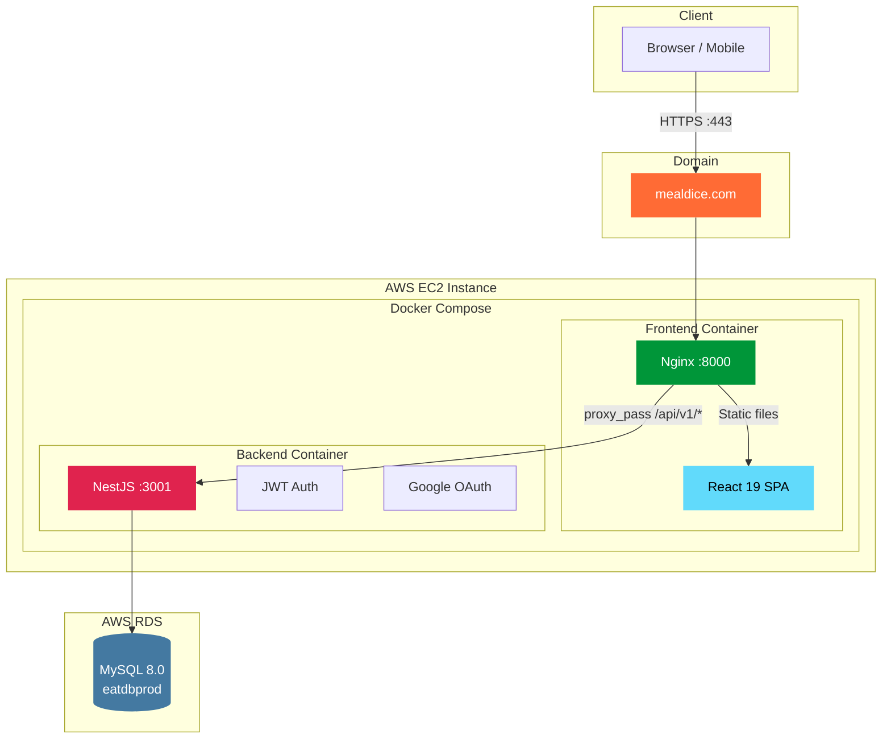
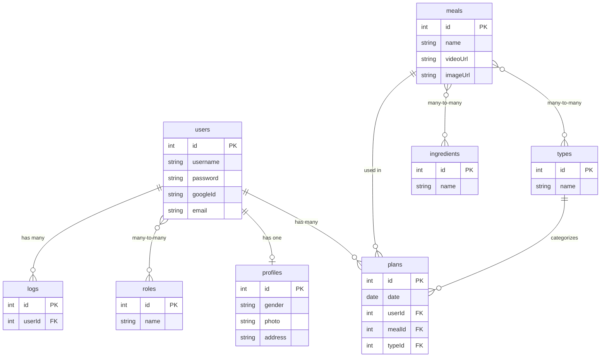
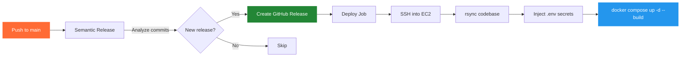
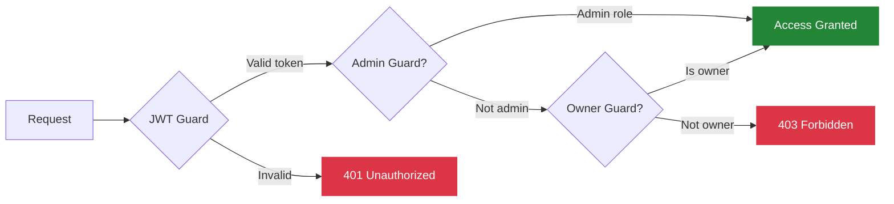

# MealDice — What Should We Cook Today?

> A full-stack meal planning application that eliminates the daily "what should I eat?" dilemma. Roll the dice, get personalized meals, and generate grocery lists — all in one tap.

**Live:** [https://mealdice.com](https://mealdice.com)

---

## Features

- **Today View** — See today's breakfast, lunch, and dinner at a glance with large food imagery
- **Meal Dice (Shuffle)** — Randomize individual meals or your entire day with a single tap
- **Weekly Meal Plans** — Auto-generate a full 7-day meal plan, adjust any meal, and save
- **Smart Meal Replacement** — Swap out any meal while respecting your type preferences (breakfast/lunch/dinner)
- **Saved Plans History** — Browse your saved meal history with visual food cards
- **Google OAuth + Local Auth** — Sign in with Google or create a traditional account
- **Role-Based Access** — Admin panel for managing meals, ingredients, users, and roles
- **Cooking Videos** — Click any meal to watch its cooking tutorial
- **Responsive Design** — Works on desktop and mobile

---

## Architecture



---

## Data Model



> Constraint: `UNIQUE(user_id, date, type_id)` — one meal per user per slot per day.

---

## Tech Stack

### Frontend

| Technology | Purpose |
|---|---|
| **React 19** | UI framework |
| **TypeScript** | Type safety |
| **React Router 7** | Client-side routing |
| **Zustand** | Lightweight state management |
| **Bootstrap 5 + React-Bootstrap** | UI components |
| **Axios** | HTTP client |
| **Nginx** | Static file serving & reverse proxy |

### Backend

| Technology | Purpose |
|---|---|
| **NestJS 11** | Server framework (Node.js) |
| **TypeScript 5** | Type safety |
| **TypeORM** | Database ORM |
| **MySQL 8.0** | Relational database |
| **Passport.js** | Authentication (JWT + Google OAuth) |
| **Argon2** | Password hashing |
| **Winston** | Structured logging |
| **class-validator** | DTO validation |

### DevOps & Infrastructure

| Technology | Purpose |
|---|---|
| **Docker & Docker Compose** | Containerization |
| **AWS EC2** | Application hosting |
| **AWS RDS** | Managed MySQL database |
| **Nginx** | Reverse proxy + SSL termination |
| **Let's Encrypt** | Free SSL/TLS certificates |
| **GitHub Actions** | CI/CD pipeline |
| **Semantic Release** | Automated versioning & releases |
| **Commitlint + Husky** | Conventional commit enforcement |

---

## CI/CD Pipeline



Versioning follows [Conventional Commits](https://www.conventionalcommits.org/):
- `feat:` → minor version bump
- `fix:` → patch version bump
- `feat!:` / `BREAKING CHANGE` → major version bump

---

## API Reference

All endpoints are prefixed with `/api/v1`.

### Auth (`/auth`)

| Method | Endpoint | Auth | Description |
|---|---|---|---|
| `POST` | `/auth/signup` | Public | Register new user |
| `POST` | `/auth/signin` | Public | Login (returns JWT token) |
| `GET` | `/auth/me` | JWT | Get current authenticated user |
| `GET` | `/auth/google` | Public | Initiate Google OAuth flow |
| `GET` | `/auth/google/callback` | Public | Google OAuth callback (redirects with token) |

### Users (`/users`)

| Method | Endpoint | Auth | Description |
|---|---|---|---|
| `GET` | `/users` | JWT | List all users (filterable by username, role, gender) |
| `POST` | `/users` | JWT | Create a new user |
| `GET` | `/users/:id` | JWT | Get user by ID |
| `PUT` | `/users/:id` | JWT + Owner/Admin | Update user (non-admins cannot modify roles) |
| `DELETE` | `/users/:id` | JWT + Admin | Delete user |
| `GET` | `/users/profile` | JWT | Get user profile by query `?id=` |
| `GET` | `/users/logs` | JWT | Get user activity logs by query `?id=` |
| `GET` | `/users/logsByGroup` | JWT | Get user logs grouped by result `?id=` |

### Meals (`/meals`)

| Method | Endpoint | Auth | Description |
|---|---|---|---|
| `GET` | `/meals` | Admin | List meals (paginated, filterable by `?page=&limit=&type=`) |
| `GET` | `/meals/options` | Admin | Get meals by type `?typeId=` |
| `POST` | `/meals` | Admin | Create a new meal |
| `GET` | `/meals/:id` | Admin | Get meal by ID |
| `PUT` | `/meals/:id` | Admin | Update meal |
| `DELETE` | `/meals/:id` | Admin | Delete meal |

### Plans (`/plans`)

| Method | Endpoint | Auth | Description |
|---|---|---|---|
| `GET` | `/plans` | Admin | List all plans |
| `GET` | `/plans/byUser` | Admin | Get all plans grouped by user |
| `GET` | `/plans/me` | JWT | Get current user's saved plans |
| `POST` | `/plans` | JWT | Create a single plan |
| `POST` | `/plans/weekly-preview` | JWT | Generate 7-day draft plan (not persisted) |
| `POST` | `/plans/replace-meal` | JWT | Get random replacement meal of same type |
| `POST` | `/plans/weekly-commit` | JWT | Bulk save weekly plans to database |
| `DELETE` | `/plans/:id` | JWT | Delete a plan |

### Ingredients (`/ingredients`)

| Method | Endpoint | Auth | Description |
|---|---|---|---|
| `GET` | `/ingredients` | Admin | List all ingredients |
| `POST` | `/ingredients` | Admin | Create ingredient |
| `PUT` | `/ingredients/:id` | Admin | Update ingredient |
| `DELETE` | `/ingredients/:id` | Admin | Delete ingredient |

### Auth Guards



---

## Getting Started

### Prerequisites

- Node.js 20+
- Docker & Docker Compose
- npm

### Local Development

```bash
# 1. Clone
git clone https://github.com/mingyueliu/whatToEat.git
cd whatToEat

# 2. Install dependencies
npm install

# 3. Start MySQL (Docker)
docker compose -f docker-compose.db.yml -p whattoeat-local up -d

# 4. Start both frontend & backend
npm run dev
```

- Frontend: `http://localhost:3000`
- Backend: `http://localhost:3001`
- MySQL: `localhost:3307`

### Production Deployment

```bash
# Runs automatically via GitHub Actions on push to main
# Manual deploy:
docker compose up -d --build
```

---

## Project Structure

```
whatToEat/
├── .github/workflows/
│   └── deploy.yml              # CI/CD pipeline
├── packages/
│   ├── backend/
│   │   ├── config/             # Environment-specific YAML configs
│   │   ├── src/
│   │   │   ├── auth/           # JWT + Google OAuth
│   │   │   ├── user/           # User management + profiles
│   │   │   ├── meal/           # Meal CRUD
│   │   │   ├── plan/           # Meal planning logic
│   │   │   ├── ingredient/     # Ingredient management
│   │   │   ├── type/           # Meal types (breakfast/lunch/dinner)
│   │   │   ├── role/           # RBAC roles
│   │   │   ├── guards/         # JWT, Admin, OwnerOrAdmin guards
│   │   │   ├── filters/        # Global exception handlers
│   │   │   └── app.module.ts   # Root module
│   │   └── Dockerfile
│   └── frontend/
│       ├── src/
│       │   ├── pages/
│       │   │   ├── today/      # Main "What to cook today" view
│       │   │   ├── weekplans/  # Weekly plan generator
│       │   │   ├── userplans/  # Saved plans history
│       │   │   ├── meals/      # Admin: meal management
│       │   │   ├── profile/    # User profile
│       │   │   └── ...
│       │   ├── store/          # Zustand stores
│       │   ├── components/     # Shared components
│       │   └── styles/         # Global CSS
│       ├── nginx.conf
│       └── Dockerfile
├── docker-compose.yml          # Production containers
├── docker-compose.db.yml       # Local MySQL
└── package.json                # Monorepo root
```

---

## License

MIT

---

Built by **Mingyue Liu** | [mealdice.com](https://mealdice.com)
